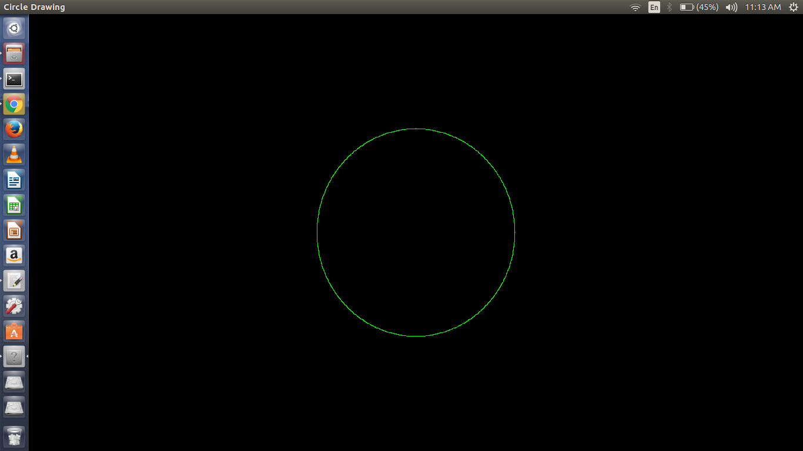

## Open GL installation on Linux

###  1. Open Terminal on Linux & run following commands for installation

```
sudo apt update
```
```
sudo apt install freeglut3
```
```
sudo apt install freeglut3-dev
```
```
sudo apt install binutils-gold
```
```
sudo apt install g++ cmake
```
```
sudo apt install libglew-dev
```
```
sudo apt install mesa-common-dev
```
```
sudo apt install build-essential
```
```
sudo apt install libglew1.5-dev libglm-dev
```

### 2. Verify Installation

```
 glxinfo | grep -i opengl
```
 Output should be simillar to this (do not run this)

 ```
 OpenGL vendor string: NVIDIA Corporation
OpenGL renderer string: GeForce 8800 GT/PCIe/SSE2
OpenGL version string: 2.1.2 NVIDIA 310.44
OpenGL shading language version string: 1.20 NVIDIA via Cg compiler
OpenGL extensions:
```

### 3. Creating and Running Sample Program
 
  * Create a directory
  
    ```
    mkdir sample
    ```
  * Change working Directory
  
    ```
    cd sample
    ```
  * Create Sample program
    
    ```
    gedit main.c
    ```
    * sample program:
    
     ```c
	#include<stdio.h>
    #include<GL/glut.h>
    #include<math.h>
    #define pi 3.142857

    void myInit (void)
    {
    	glClearColor(0.0, 0.0, 0.0, 1.0);
    	glColor3f(0.0, 1.0, 0.0);
    	glPointSize(1.0);
    	glMatrixMode(GL_PROJECTION);
    	glLoadIdentity();
    	gluOrtho2D(-780, 780, -420, 420);
    }

    void display (void)
    {
    	glClear(GL_COLOR_BUFFER_BIT);
    	glBegin(GL_POINTS);
    	float x, y, i;
    	for ( i = 0; i < (2 * pi); i += 0.001)
    	{
    		x = 200 * cos(i);
    		y = 200 * sin(i);
    		glVertex2i(x, y);
    	}
    	glEnd();
    	glFlush();
    }

    int main (int argc, char** argv)
    {
    	glutInit(&argc, argv);
    	glutInitDisplayMode(GLUT_SINGLE | GLUT_RGB);
    	glutInitWindowSize(1366, 768);
    	glutInitWindowPosition(0, 0);
    	glutCreateWindow("Circle Drawing");
    	myInit();
    
    	glutDisplayFunc(display);
    	glutMainLoop();
    }

     ```

  * Compile program
  
    ```
     g++ main.c -lglut -lGL -lGLEW -lGLU -o output
    ```
  * Run the program

    ```
    ./output
    ```
  
  * Verify Output
    
    
